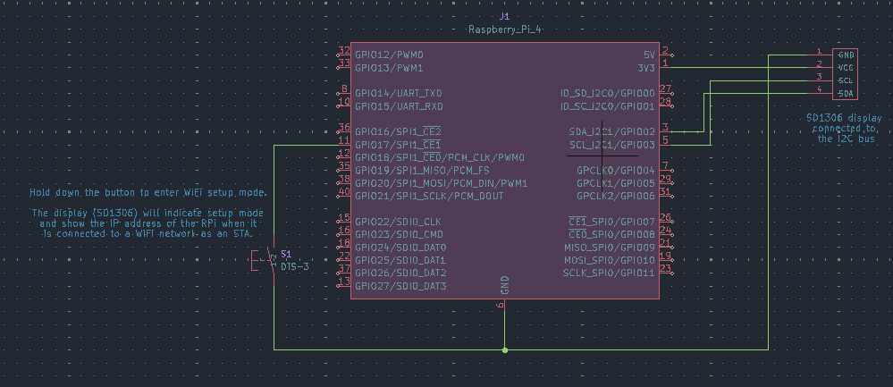
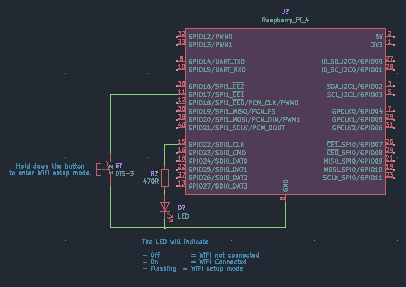
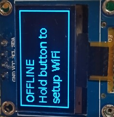
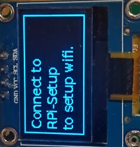
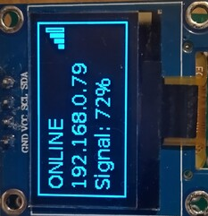

### RPi WiFi Manager

A WiFi provisioning tool for the Raspberry Pi (RPi).

To setup the Wifi the user holds down a button and a wifi captive portal is started. The user can then connect to the RPi wifi hotspot (captive portal) using a mobile or tablet. Once connected the user is automatically presented with the ability to select the WiFi SSID and enter the password to connect the Raspberry Pi a Wifi network.

# Features

- An [oled (12 x 64)](https://www.amazon.co.uk/s?k=oled+display+arduino+128+x+64&crid=3I23B4EH9PBEX&sprefix=oled+display+arduino+128+x+64%2Caps%2C114&ref=nb_sb_noss_1) display is supported. This will display the Online/Offline status, IP address and WiFi signal strength.
- If the oled display is connected then a file system interface is available to allow other apps to send data to the oled display.
- Optionally allows a single LED to display the WiFi connectivity if no oled display is connected.
- Supports aarch64 and armv7 architectures.

## Hardware Requirements

# With oled display

- Button: Momentary switch (Default: GPIO 17). 5s hold for portal, tap to wake.

 - Display: 128 x 64 SSD1309 / SSD1306 OLED (I2C).

The RPI should be connected as shown below. Any valid GPIO pin can be connected to the button.



# Without oled display

- Button: Momentary switch (Default: GPIO 17). 5s hold for portal, tap to wake.

- An LED connected to a GPIO pin on the  RPi interface connector

The RPI should be connected as shown below. Any valid GPIO pins can be connected to the button and LED.



When starting the rpi_wifi_setup command use the '--led_pin' argument followed by the GPIO pin you have an LED connected to.
The LED will be used to display WiFi connectivity not an oled display.

## Installation & Versions

This project is supplied with custom install script that handles virtual environment creation and and version switching.

1. System Prep

The RPi must have bookworm or later OS and have I2C enabled is the oled display is connected. The raspi-config can be used to enable I2C (raspi-config tool can be used to enable I2C).

2. Run the Installer. The install.py and python wheel files from the github release should be copied to the RPi.

```
sudo ./install.py rpi_wifi_setup-0.1.0-py3-none-any.whl
```

The filename version may change.

3. Service Control

To cause the rpi_wifi_setup command to run when the RPi starts up run

```
sudo rpi_wifi_setup --enable_auto_start
INFO:  OS: Linux
INFO:  SERVICE FILE: /etc/systemd/system/rpi_wifi_setup.service
INFO:  Created /etc/systemd/system/rpi_wifi_setup.service
INFO:  Enabled rpi_wifi_setup.service on restart
INFO:  Started rpi_wifi_setup.service
```


## Usage
Standard Mode

The screen displays ONLINE/OFFLINE status, the IP Address, and a Signal Strength icon.

The screen sleeps after 120s (default) to prevent OLED burn-in. A quick press on the button wakes the screen.

# Setting up RPi WiFi

- When the WiFi is not connected the oled display shows



If no oled display is connected then the LED will be off.

- Hold down the button for 5 seconds. The oled display will show



If no oled display is connected the LED will be flashing to indicate setup mode.

- Using a mobile or tablet connect to the hotspot named 'RPi-Setup'. You will be prompted to sign in to the WiFi network. Select the SSID of the Wifi network that you wish the RPi to connect from the dropdown list and enter its password.


- Select the Connect button and when the RPi connects to the WiFi network the oled display shows ( The IP address may change).



If no oled display is connected the LED will be on to indicate the Wifi is connected.


# External App Integration (Override)

The app now supports an interrupt-driven "Mailbox" feature. Any application on the RPi can hijack the OLED display by writing to a temporary file.

    Override Path: /tmp/oled_override.txt

    Behavior: Writing to this file triggers an instant kernel interrupt (inotify).
    The manager wakes the screen, ignores WiFi status, and displays the file's text.

    Reverting: Deleting the file instantly returns the display to the standard WiFi/IP status screen.

# E.G Display system stats
echo -e "CPU: 55C\nLoad: 0.4\nStatus: Active" > /tmp/oled_override.txt

# E.G Clear and return to WiFi Status
rm /tmp/oled_override.txt


## CLI Arguments
The command line help is displayed if the -h argument is used on the command line as shown below.

```
rpi_wifi_setup -h
usage: rpi_wifi_setup [-h] [-b BUTTON_PIN] [-a I2C_ADDRESS] [-l LED_PIN] [-w DISPLAY_WIDTH] [-v DISPLAY_HEIGHT] [-s SSID] [-p PASSWORD] [-o SCREEN_OFF_SECONDS] [-d] [--enable_auto_start]
                      [--disable_auto_start] [--check_auto_start]

Linux WiFi provisioning tool.

options:
  -h, --help            show this help message and exit
  -b, --button_pin BUTTON_PIN
                        The GPIO pin that the WiFi button is connected to (default = 17).
  -a, --i2c_address I2C_ADDRESS
                        The I2C bus address of the SSD1306 display (default=3c).
  -l, --led_pin LED_PIN
                        If using an LED rather than an oled display to indicate WiFi connectivity then this argument must be the GPIO pin used to drive the LED.
  -w, --display_width DISPLAY_WIDTH
                        The display width in pixels (default = 128).
  -v, --display_height DISPLAY_HEIGHT
                        The display height in pixels (default = 64).
  -s, --ssid SSID       The portal SSID to connect your mobile/tablet (default = RPi-Setup).
  -p, --password PASSWORD
                        The portal password when connecting your mobile/tablet (default = None).
  -o, --screen_off_seconds SCREEN_OFF_SECONDS
                        The the screen off timer (default = 120). Set to 0 to disable.
  -d, --debug           Enable debugging.
  --enable_auto_start   Auto start when this computer starts.
  --disable_auto_start  Disable auto starting when this computer starts.
  --check_auto_start    Check the running status.
```

The install.py command also has command line help as shown below.

```
/install.py -h
usage: install.py [-h] {install,uninstall,status,switch} ...

rpi_wifi_setup: install is the default command.

positional arguments:
  {install,uninstall,status,switch}

options:
  -h, --help            show this help message and exit
```

## Architecture
Main Loop: 10s heartbeat for signal/network checks (low power).

Interrupt Thread: watchdog (inotify) monitoring /tmp for zero-latency UI updates.

Thread Safety: threading.Lock ensures atomic access to the I2C bus between the heartbeat and interrupt triggers.

### Credits & Acknowledgments

This project is a high-level Python wrapper and hardware interface for the balena-io/wifi-connect project.

    WiFi Management: All captive portal logic, AP switching, and captive portal UI foundations are provided by Balena.

    Balena WiFi-Connect is used under the MIT License.
